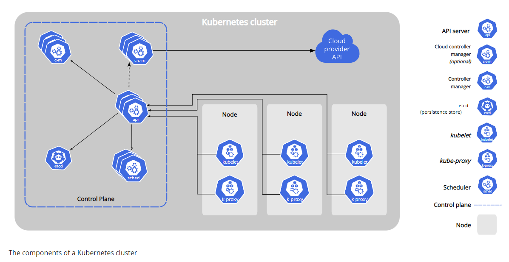
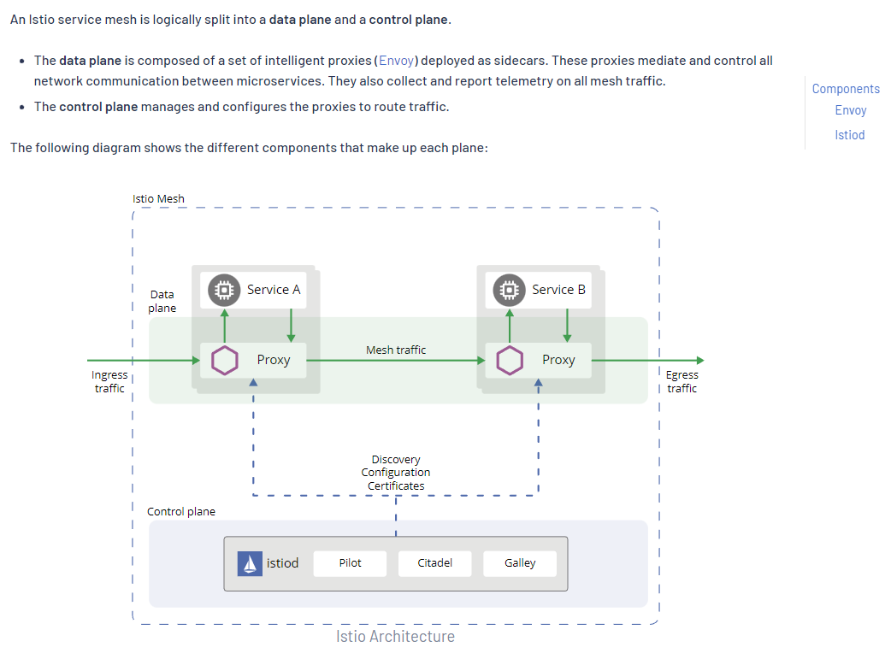
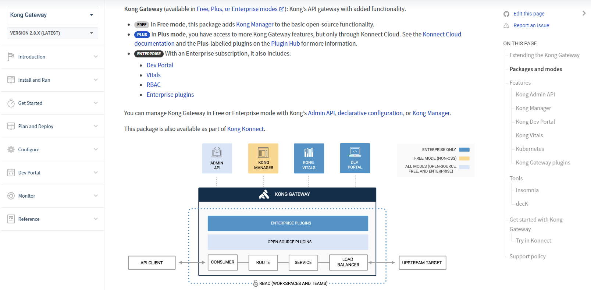

# Kubernetes architecture (latest 2022 Jun 23)
- https://kubernetes.io/docs/concepts/overview/components/

## Control plane components

Control plane components (kube-apiserver, etcd, kube-scheduler, kube-controller-manager, cloud-controller-manager)

### kube-apiserver
-  Front end for the Kubernetes control plane
-  Designed to scale horizontally—that is, it scales by deploying more instances
-  

### etcd
- Consistent and highly-available key value store
- store for all cluster data
- requires backup plan

### kube-scheduler
- Watches for newly created Pods with no assigned node, and selects a node for them to run on

### kube-controller-manager
- Runs controller processes
- Example controllers
  - `Node controller` - noticing and responding when nodes go down
  - `Job controller` - Watches for Job objects that represent one-off tasks, then creates Pods to run those tasks to completion.
  - `Endpoints controller` - Populates the Endpoints object (that is, joins Services & Pods)
  - `Service Account & Token controllers` -  Create default accounts and API access tokens for new namespaces.

### cloud-controller-manager
- Embeds cloud-specific control logic
- The cloud controller manager lets you link your cluster into your cloud provider's API, and separates out the components that interact with that cloud platform from components that only interact with your cluster.
- Only runs controllers that are specific to your cloud provider
- If you are running Kubernetes on your own premises, or in a learning environment inside your own PC, the cluster does not have a cloud controller manager

  
## Node components

Node components (kubelet, kube-proxy, container runtime CRI)

### kubelet
- An agent that runs on each node in the cluster. It makes sure that containers are running in a Pod.

### kube-proxy
- A network proxy that runs on each node in your cluster, implementing part of the Kubernetes Service concept.
- Maintains network rules on nodes. 
- These network rules allow network communication to your Pods from network sessions inside or outside of your cluster.

### Container runtime (CRI)
- the software that is responsible for running containers
- implements CRI
- e.g. containerd, CRI-O

### Addons

Addons

- Addons use Kubernetes resources (DaemonSet, Deployment, etc) to implement cluster features.
- Because these are providing cluster-level features, namespaced resources for addons belong within the `kube-system` namespace.
- Addons exampls:
  - Calico / Cilium
  

### Workloads

Workloads

- `Pod`
- `Deployments`
- `ReplicaSet`
- `StatefulSets`
- `DaemonSet`
- `Job`
- `CronJob`
- `ReplicationController`

### Service
- `An abstract way to expose an application running on a set of Pods as a network service.`

Service

- 
  

# Isito architecture (latest 2022 Jun 23)
- https://istio.io/latest/docs/ops/deployment/architecture/

# Kong Gateway architectdure (v2.8.x 2022 Jun 23)
- https://docs.konghq.com/gateway/latest/?_ga=2.26508474.647905959.1655972611-545925518.1655972611

