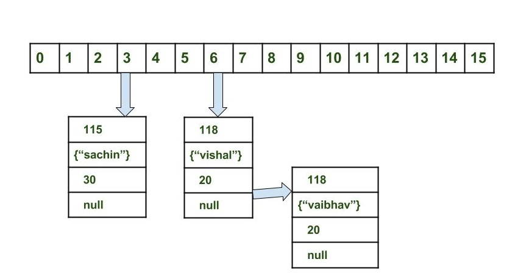

## Reference doc:
- https://www.geeksforgeeks.org/java-util-hashmap-in-java-with-examples/
- https://docs.oracle.com/javase/6/docs/api/java/util/HashMap.html

- HashMap in Java stores the data in (Key, Value) pairs
- Similar to `HashTable`, but it is *unsynchornized*
- *Not threadsafe*
- Allows to store *only one null key object*, but can be *more than one null values*
- HashMap has no guarantees as to the order of the map  (TreeMap can have order)

## Implementation
- https://www.geeksforgeeks.org/internal-working-of-hashmap-java/
- A collection of `Buckets`
- Buckets: A bucket is an element of the HashMap array. It is used to store nodes.
- Number of buckets (Initial capacity)

## Buckets
- A bucket is an element of the HashMap array. It is used to store nodes.
- A Linked list to store nodes. 

## hashcode() and equals()
- `hashcode()` 
    - is used to calculate the index of bucket.
    - important to calculate which bucket to store the entry. e.g. If `hashcode()` is not implemented well and always picking the same bucket to store entry, the efficiency will be lower.
- `equals()` 
    - compare the `key` if they are equal or not. 

## Collision
- When **bucket index** of two or more nodes are the same
- Nodes are joined by a link list (e.g. 1st node <- 2nd node <- 3rd node)
- When collision, the linked list is traversed 
    - until the key matches, or 
    - null is found on the next field.



## Characteristics
- provides constant-time performance for the basic operations (get and put), assuming the hash function disperses the elements properly among the buckets. 
- Iteration over collection views requires time proportional to the "capacity" of the HashMap instance (the number of buckets) plus its size (the number of key-value mappings). Thus, it's very important not to set the initial capacity too high (or the load factor too low) if iteration performance is important.

## Initial capacity and Load Factor
```
capacity = number of buckets * load factor
```

### Initial capacity
- number of buckets

### Load factor
- how full the hash table is allowed to get before its capacity is automatically increased.
- When the number of entries in the hash table exceeds the product of the load factor and the current capacity, 
    - the hash table is rehashed (that is, internal data structures are rebuilt) 
    - so that the hash table has approximately twice the number of buckets.
- *default load factor (.75)* offers a good tradeoff between time and space costs
- Higher values of load factor: 
    - decrease the space overhead 
    - but increase the lookup cost (reflected in most of the operations of the HashMap class, including get and put)