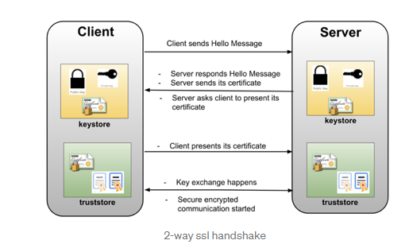

# Keystore vs Trustore

`Keystore` is used to store private key and identity certificates that a specific program should present to both parties (server or client) for verification.

`Truststore` is used to store certificates from Certified Authorities (CA) that verify the certificate presented by the server in SSL connection.

# Two way SSL

1. Client send request
2. Server present the Server's CA certificate to Client, also server request client to present it's certificate
3. Client verifies server's identity, and present Client's CA certificate to server
4. Server verifies Client's CA cert
5. Mutual Key exchange happens (Mutual handshake), the secured encrypted communication started

# Root CA and Intermediate CA (Public Key Infrastructure (PKI))

- `Root Certificate`. A root certificate is a digital certificate that belongs to the issuing Certificate Authority. 
  - It comes pre-downloaded in most browsers and is stored in what is called a “trust store.” The root certificates are closely guarded by CAs.
- `Intermediate Certificate`. Intermediate certificates branch off root certificates like branches of trees. 
  - They act as middle-men between the protected root certificates and the server certificates issued out to the public. 
  - There will always be at least one intermediate certificate in a chain, but there can be more than one.
- `Server Certificate`. The server certificate is the one issued to the specific domain the user is needing coverage for.

# Create Self sign cert
- https://www.thomasvitale.com/https-spring-boot-ssl-certificate/
- https://hellokoding.com/resttemplate-and-java-truststore-in-spring-boot/

## Reference
- https://www.educative.io/answers/keystore-vs-truststore  (Keystore vs truststore)
- https://docs.solace.com/Security/Two-Way-SSL-Authentication.htm (Two-way SSL)
- https://medium.com/@niral22/2-way-ssl-with-spring-boot-microservices-2c97c974e83 (Two-way SSL)
- https://www.venafi.com/blog/what-difference-between-root-certificates-and-intermediate-certificates (Root CA vs Intermediate CA vs Server certificate)
- https://www.thomasvitale.com/https-spring-boot-ssl-certificate/
- https://hellokoding.com/resttemplate-and-java-truststore-in-spring-boot/